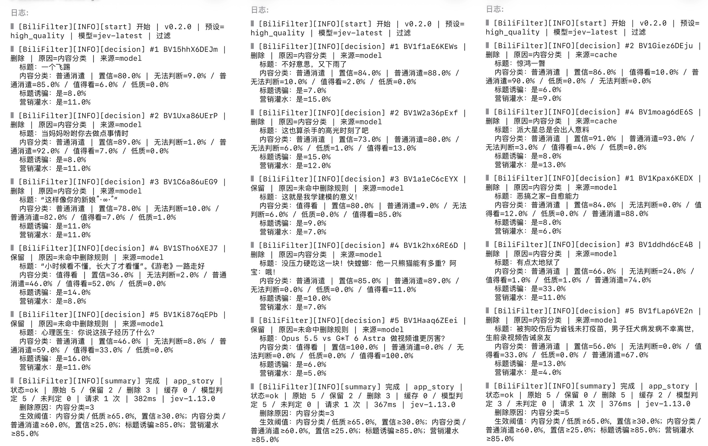

# BiliBili Jev Filter

通过 **Quantumult X 重写**，使用 [TypeSafe Jev](https://docs.typesafe.ai/models) 根据标题、简介、分区和标签等元数据过滤 B站推荐。

## 支持范围

| 场景 | 接口 |
| --- | --- |
| App 首页推荐 | `app.bilibili.com/x/v2/feed/index` |
| App 竖屏推荐 | `app.bilibili.com/x/v2/feed/index/story` |
| 网页首页推荐 | `api.bilibili.com/x/web-interface/(wbi/)index/top/feed/rcmd` |
| 网页相关推荐 | `api.bilibili.com/x/web-interface/archive/related` |

仅处理上述 JSON 接口，不支持 gRPC / Protobuf、动态、热门和搜索。

## 实测效果

## 安装

需要 Quantumult X 和自己的 TypeSafe API Key，其他网络工具可进行订阅转换后使用。

### 远程订阅

1. 在 QX 中添加[重写订阅](https://raw.githubusercontent.com/RzMY/BiliBili-Filter/refs/heads/main/rewrite/bilibili-filter.snippet)。
2. 按 [BoxJS 官方文档](https://docs.boxjs.app) 配置 BoxJS，添加本项目的[应用订阅](https://raw.githubusercontent.com/RzMY/BiliBili-Filter/refs/heads/main/boxjs/bilibili-filter.boxjs.json)。
3. 在 BoxJS 中打开“B站推荐过滤 · Jev”，填写 API Key 并保存。

### 本地安装

1. 将 [bilibili-filter.js](scripts/bilibili-filter.js) 复制到 iPhone 本地或 iCloud Drive 的 `Quantumult X/Scripts` 目录，保留文件名。
2. 将[本地重写配置](rewrite/quantumult-x.local.conf)合并到 QX 配置的 `[rewrite_local]` 和 `[MITM]` 段。
3. 在 QX 脚本修改页面填写 API Key。

## 使用

默认预设为 **高质量精选**，过滤较确定的普通消遣、低质内容、标题诱骗和营销灌水，相当于白名单模式。**严格过滤** 对普通消遣更宽容，仅过滤明确的低质内容，相当于黑名单模式。日志与通知、模型预设、提示词和过滤规则均可在 BoxJS 中查看并自定义配置。

## 许可

本项目使用 MIT License，详见 [LICENSE](LICENSE)。